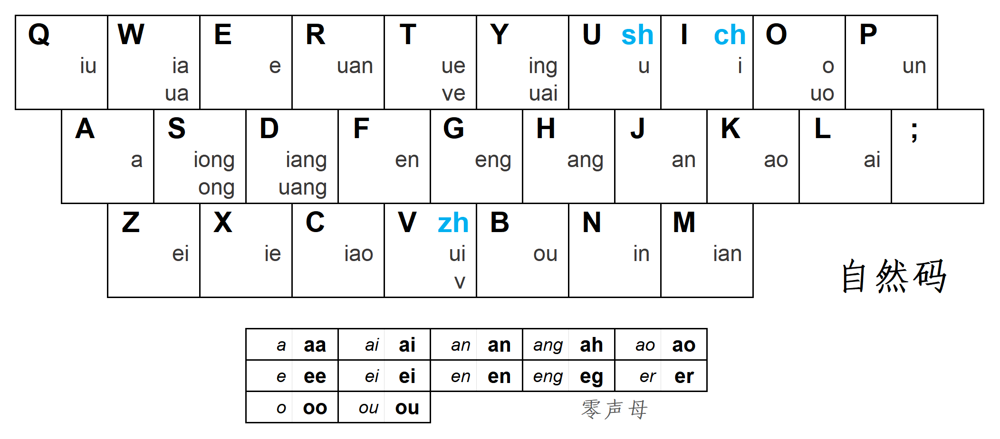
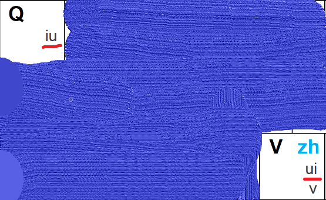
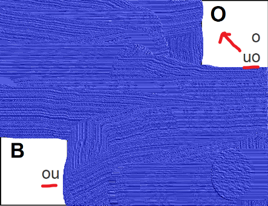
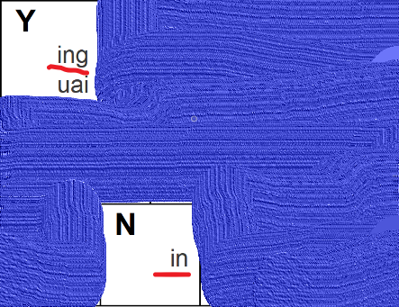
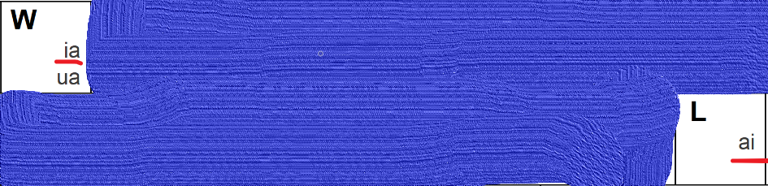

# 自然码双拼方案学习

### 第一层

单声母 + 单韵母 和一些零声母

Ha之类不需要记忆

零声母需要注意些

ang - ah

eng -eg

### 第二层

复合韵母对称分布

（贼-写）

(en -g -an)

(秋-围)

(ou->o - 欧)

(英-您)

(来- wia)

### 第三层

符合韵母无规律

S ong 嵩

M ian 面

K ao 考

R uan 软

啥也不是

**D iang/uang**

**P un**

**Y uai**

**T ue**

**难记！！！！**

### 第四层

特殊声母+单韵母

V ————zh

I ————ch

U ————sh

### 第五层

特殊声母+复合韵母

zh uang ---> VD

ch un ---> IP

sh un ---> up

后记： 

​	除了第三层后面那几个比较难，其他的都还可以。

[引用链接](https://blog.csdn.net/caib1109/article/details/51339364?depth_1-utm_source=distribute.pc_relevant.none-task-blog-BlogCommendFromBaidu-3&utm_source=distribute.pc_relevant.none-task-blog-BlogCommendFromBaidu-3)

[学习网站](https://api.ihint.me/shuang/)

感谢！！！